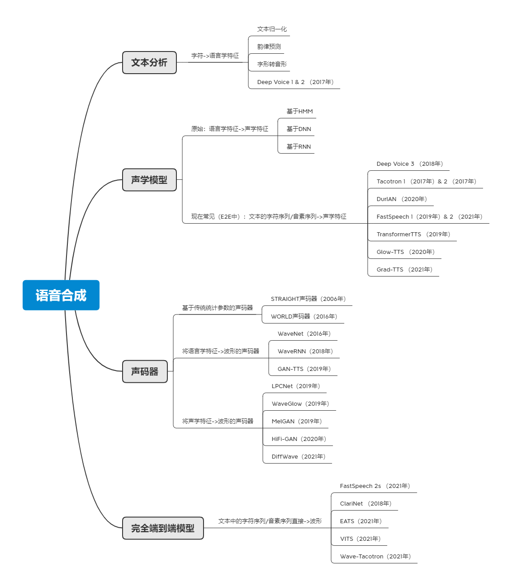
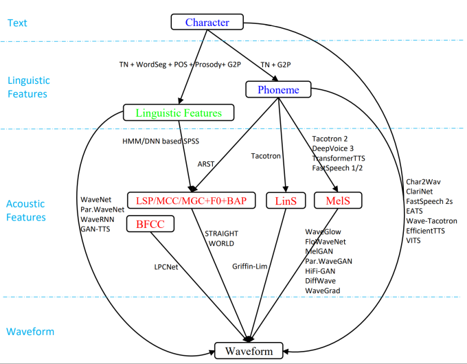
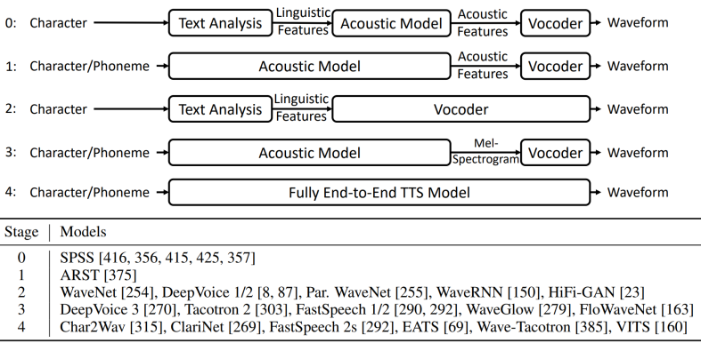

# 语音合成基础

## 人体发声/听觉原理

## TTS技术的演进

### 总览（宏观层面，1970s~2020s）
*最好包含实际效果体验*
#### mid 1970s
物理建模，基于人体发声原理构建模型（Articulatory Speech Synthesis），是最理想的合成方式，但因为发音行为很难建模且模拟数据难采集，效果很差。

#### late 1970s
语言学家引入domain knowledge，把人体发声原理抽象成source（肺部、声带振动）-filter（口腔、鼻腔），针对共振峰的一些参数构建共振峰模型（Formant Speech Synthesis），不依赖数据库，模型细粒度不够，效果较差。

#### 1990s
提前构建语音大规模数据库，通过寻找合适片段进行再拼接的方式（Concatenative Speech Synthesis），合成语音不自然、情绪不受控制。

#### 1995
基于统计的参数合成方法（Statistical Parametric Speech Synthesis）。通过文本分析得到语言学特征，声学模型将语言学特征转成声学参数，声码器再完成波形的合成。
其中：声学模型是基于统计学模型，比如传统的隐马尔可夫模型（HMM）和最近的深度神经网络。
HMM存在上下文信息不足、决策树聚类不够精细的问题；而神经网络能够拟合任何的函数映射，不断取代SPSS中的一个或多个模块以增加语音合成的表现力；

该方法如下图所示：

解决了上述大部分问题，具有灵活、对数据量要求小的优点，但依旧不自然、且杂音较严重。

#### 2013
基于神经网络的语音合成（Neural Speech Synthesis）。早期2013年还是基于统计参数进行合成，只是将部分模块（如声学模型）中原始的统计学方法（如HMM）换成了深度学习（DNN、RNN）。后来，2016年诞生了端到端神经语音合成系统，【里程碑：Wavenet】直接端到端的从语言学特征到生成波形。如下图所示：

#### 总结：

**模型构建趋势**上，都在构建端到端的神经网络语音合成模型；

**文本分析**上，简化了大量的语言学特征，目前基本只用音素Phoneme，省去文本分析模块，用文本序列（本质为字符）作为输入；

**声学模型**上使用更加powerful的模型；

**声学特征**上简化到只用梅尔谱（多）（Mel-spectrogram）/线性谱（少）作为参数；

**声码器**上也逐渐使用神经网络替代参数声码器。

### 近十年技术框架迭代路线（微观层面，2015~2022）

## TTS系统的组成部分
TTS系统最细化可分为以下3部分（类比网络中的OSI模型），但随着DL模型隐式概念的引入，系统的组成部分逐渐被简化（一是确实摆脱了传统建模方式对完整人体发声的复刻还原【没必要】；二是追求DL建模的可解释性，更好的把控所提出的模型【好解释】）

### 文本分析Text analysis
目的：将文本字符转换成音素或语言学特征（如持续时间、词性标签）。

包括内容：

①文本规范化

消除非标准词在读音上的歧义，例如数字、日期、缩写、符号等（基于规则或模型），转变成机器可读的形式，e.g. 1989 -> 一九八九 or nineteen eight nine

②分词

英文做多音节的音节划分，汉语做分词

③词性标注

标注一句中的重读、语调走向（升降）

④韵律预测

节奏、重读、句调、韵律边界预测（停顿）,反映在音节持续时间、响度、音调变化、能量、基频上。

e.g. FastSpeech2对持续时间(韵律)、重音和能量等因素预测学习，然后使用MFA对文本转音素进行处理，在合成效果和非自回归的合成速度上有较大提升。

⑤文本转音素/字音转换Grapheme to Phoneme（注音）

多音字消歧、儿化音、变调问题
speech -> sp-iy-ch，中文是转拼音音素

传统SPSS需要很Dense的语言学特征，而E2E模型只需音素即可。但文本分析这一环节必不可少。

### 声学模型Acoustic Model
目的：将语言学特征、音素或字符序列转换成声学特征（如基频、频谱等）。

DL方法好于SPSS的原因：在没有Domain Knowledge指导时，参数统计方法会根据语言学特征预测一些声学特征的相干系数，如Mel广义系数、F0基频信号等。但这种方式也会带来一些问题，例如：如何更好的联系上下文信息，如何建模输出帧的相关性，如何解决过于平滑带来的细节缺失问题？而这些都可以通过深度学习网络模型的隐式建模被简单且高效的解决。

DL模型的优点：
①传统声学模型要求语言和声学特征之间的对齐，而基于序列到序列的神经模型则通过注意隐式地学习对齐，或者联合预测持续时间，这是一种端到端且需要较少预处理的方法。
②随着神经网络建模能力的增强，语言特征被简化为仅需要字符或音素序列，声学特征已从低维和压缩倒谱（如MGC）转变为高维的Mel谱图或线性谱图。

E2E模型举例：
RNN-based：Tacotron系列、DurIAN
CNN-based：DeepVoice系列
Transformer-based：FastSpeech系列

### 声码器vocoder
目的：根据提取语言学特征或声学特征，合成语音波形（梅尔谱）。
本质：生成模型，使用Flow、GAN（工业界主流，音质较好）、VAE（少用）、Diffusion等

神经声码器：利用神经网络强大的非线性拟合能力从语音特征转换为语音波形（采样点）。

经验搜集：最好针对自己的数据集自己训练一个声码器模型，非常有助于提升最后的音质。

### 端到端模型E2E Model
目的：直接将字符或音素序列转换成语音波形。使合成系统能够尽量的简化，减少人工干预和对语言学相关背景知识的要求，降低训练难度，避免级联模型带来的错误传递。

端到端模型的发展经历了以下几个阶段：
|阶段|说明|
|-|-|
| 阶段0 | 在统计参数合成方法中，使用文本分析、声学模型和声码器三个模块级联 |
| 阶段1 | 在统计参数合成方法中，将前两个模块合起来形成一个声学模型 |
|阶段2|直接从语言学特征生成最终的波形，例如 WaveNet|
|阶段3|声学模型从字符或音素生成声学特征Mel谱（一般通过神经网络），然后利用神经声码器生成波形|
|阶段4|完全端到端的神经网络模型|

本质是一套seq2seq模型：

编码器——解码器架构：解决了对齐问题，但信息过度压缩（M—>1—>N）；

编码器——注意力机制——解码器架构：保留了全部编码信息，注意力机制是一种查表工具（M—>M—>N）。

---
## TTS系统的分类

### 自回归AR or 非自回归NAR

### 根据生成模型分类

### 根据网络结构分类
---

## TTS系统的性能指标

### 宏观层面（人们探讨的）

#### 实时性Fast

#### 轻量化
剪枝，量化，知识蒸馏，利用domain knowledge（加一些线性预测系数、multiband建模）

#### 低资源Low-resource

##### 自监督训练

##### 跨语种转换

##### 跨说话人转换

##### 打造语音闭环
TTS <-> ASR

#### 鲁棒Robust

##### 字符/音素与梅尔谱之间的对齐
近些年一直在用attention做对齐，呈螺旋上升趋势：一种是增强attention，一种是使用duration预测替代attention

##### 自回归生成中的exposure bias和错误传播
一种是增强AR，一种是使用NAR替代AR

#### 拟人化Expressive
建模真实场景背后的变量：文本内容，说话人，韵律，环境

#### 可适配Adaptive
定制化，一人一个TTS 

### 微观层面（论文里使用的）
人类水平：由TTS系统生成的语音在和对应人类录音相比**质量得分**在**统计意义上没有显著差别**，则称该TTS系统在该测试集上达到了人类水平。

#### 客观指标（Not reliable）

经常客观指标与人类真实感知不成相关关系，只有理论意义，实际价值不大，因此论文里也少用。

##### 1.时间等长

用原始语音的单元时长，计算差异；

##### 2.时间不等长

时间对齐，对局部差异求和；

##### 3.MCD

##### 4.PESQ

##### 5.STOI

##### 6.SI-SDR

#### 主观指标

因为合成语音的目标对象本身就是具有主观意识的人类，因此解铃还须系铃人，用主观指标衡量具有主观性的合成语音更有实际意义。

##### 1.平均意见指标MOS（Mean Opinion Score）

做法：将TTS合成的语音与人类录音mix，然后让人类1~5打分

缺点：对于同一条语音内容，没有可比性，反映不出来两个系统之间head-to-head的差异。

##### 2.CMOS（Comparative MOS）

做法：对于同一条语音内容，同时对TTS合成语音和人类录音进行打分，好的打正值，差的打负值。

##### 3.统计意义上没有显著差别

做法：50+ 句话，每句话要被20+ native speaker进行打分

目标：CMOS->0，p-value>0.05（Wilcoxon signed rank test，表示没有显著差别）

## 数据库

### 语音合成常用数据库

#### LJSpeech

#### 

### 情感语音数据库建库流程

## 经典模型框架分析

### NaturalSpeech语音合成系统（2022MAY，MSRA）

#### 设计想法

1.**语音波形复杂且高维**，采用分布式（先通过VAE将高维波形压缩到低维表征，再重建这个波形）
x -> q(z|x) -> z -> p(x|z) -> x

2.**以文本为条件生成语音波形**，使用文本/音素序列y预测先验z，y: z~p(z|y)，此时z可以和上一条VAE重建的z进行联合优化

3.**后验q(z|x)比先验p(z|y)更加复杂**，比如文本一个token对应着语音24k的采样率。训练时是重建x -> x，推理时是y -> x，因此需要尽量保证y和x足够接近，增强先验降低后验复杂度。

#### 模型结构

1. 右侧PE、WD为VAE部分，通过将**样本级别**24k采样率的点压缩到**帧级别**（一帧涵盖240个点/480个点），降低后验复杂度。

2.为增强先验y，采用了一个音素的大规模模型学习音素序列中文本的表征来构建先验。同时因为音素和帧之间不对等（一个音素可能发音持续几个帧，而且音素之间持续时间不等），设计一个持续时间预测器Durator，对时长建模来bridge length-mismatch。

3.在先验和后验之间建立一个标准化流（Normalization flow）。

4.Wave Decoder里增加memory模块（QKV，attention），利用attention机制把q作为query去查memory重建波形

## 自己的研究想法

### 研究路线
情感语音合成
先入门语音合成解决基础问题（比如失真），能够触及人类水平，结合课题（**场景自适应的拟人化情感语音反馈**，在什么地方对谁以什么样的方式说什么话）满足一定的性能要求；再引进情感加以创新。

### 结合课题
重点突破以下：
低资源（不一定）
鲁棒性（跨语种不一定）
实时性（需要，1s以下，目前工业界一般控制在0.1s~0.3s）
可适配（最好有）
空间音频/双声道语音合成（有更好，增强体验，但更多的是应用而非研究）

### 存在难点

1.一到多且不等长的映射，文本（Input）和波形（Output）本身不是一个模态，而且也不在一个层级（10个字符对应的波形采样点基本会高达六位数）
2.在文本分析模块，对于中文而言就是将汉字转化成拼音，如何更有针对性地向语音合成系统加入语气副词/语气助词/语气词来表达自己的情感/listener想接收的情感（比如怜悯、同情、鼓励、尊重等）

### TTS创新点记录

1.具有安抚性语音（干预）的建库

2.亲属声音特征追溯

3.